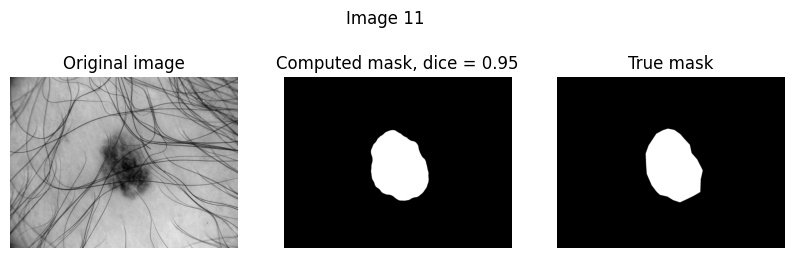
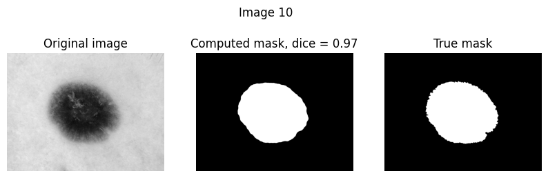

# Segmentation of Skin Lesions with Classical Image Processing Methods

## Description
The goal of this project was to implement a segmentation pipeline to extract the lesion area from skin lesions, which can be useful as a pre-processing step for machine learning classification tasks. This project is part of [Télécom Paris Image Processing](https://www.telecom-paris.fr/fr/ingenieur/formation/2e-annee-orientation/image) course and its goal was to apply classical image processing tools to solve a real-life problem. Some examples of the pipeline output are shown below.

## Dataset
The skin lesion images were taken from ISIC dataset, available on https://challenge.isic-archive.com/data/.

## Requirements
* Python 3.10
* NumPy 1.26.0
* Scikit-Image 0.21.0
* OpenCV 4.8.1

## Contributors
Paulo Roberto de Moura Júnior (me)  
Giovanni Benedetti da Rosa 

[High level description](https://github.com/paulomouraj/classic_skin_segmentation/blob/main/segmentation_skin_lesions_HLD.pdf)
